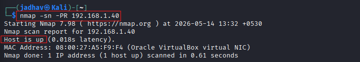
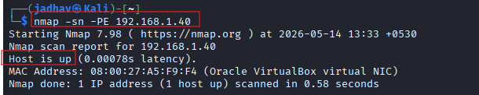
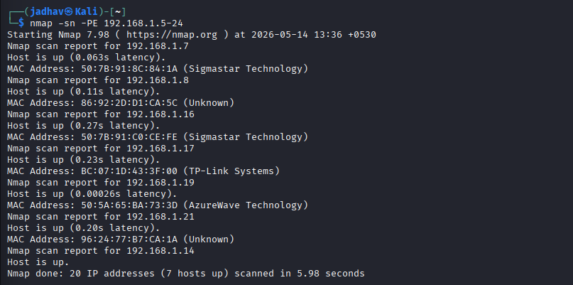
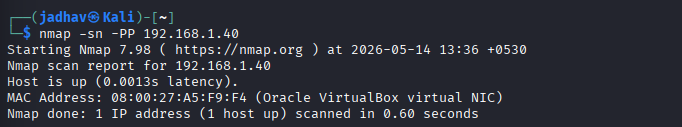
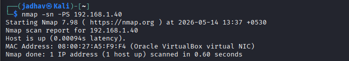
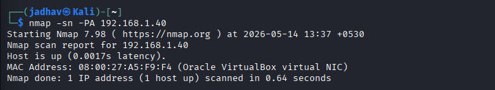
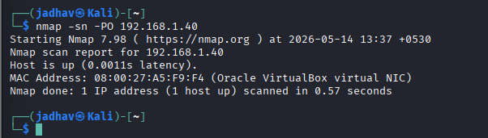

# Scanning Networks

# 1. What is Network Scanning?

Before scanning:
- Attacker first performs **Footprinting / Reconnaissance**
- Then starts **Scanning**

Scanning means:

> Collecting more detailed information about the target network or system.

The attacker tries to find:
- Live systems
- Open ports
- Running services
- Operating systems
- Vulnerabilities


# 2. Objectives of Network Scanning

Main goals:

| Objective | Purpose |
|---|---|
| Find live hosts | Identify active systems |
| Find open ports | Discover entry points |
| Identify services | Know what is running |
| Detect OS | Understand target environment |
| Find vulnerabilities | Discover weaknesses |
| Map network | Understand structure |

---

# 3. Types of Scanning

## A. Port Scanning

Checks:
- Which ports are open
- Which services are listening

### Example

| Port | Service |
|---|---|
| 80 | HTTP |
| 443 | HTTPS |
| 22 | SSH |

### Why Important?

Open ports can become entry points for attackers.

---

## B. Network Scanning

Finds:
- Active hosts
- IP addresses

### Goal

Know:
- Which systems are alive on the network

---

## C. Vulnerability Scanning


Searches for:
- Security weaknesses
- Misconfigurations
- Outdated software

### Example

- Old Apache server
- Weak SMB configuration
- Unpatched Windows system

---

# 4. Important Scanning Concepts

# TCP Communication Flags

TCP uses flags to control communication.

Important flags:

| Flag | Full Form | Purpose |
|---|---|---|
| SYN | Synchronize | Start connection |
| ACK | Acknowledgement | Confirm packet received |
| FIN | Finish | End connection |
| RST | Reset | Abort connection |
| PSH | Push | Send data immediately |
| URG | Urgent | Urgent processing |

---

# 5. TCP Three-Way Handshake

This is very important.

Connection establishment process:

```text
Client → SYN → Server
Client ← SYN-ACK ← Server
Client → ACK → Server
```

After this:
Connection established


# 6. TCP Connection Termination

Closing connection:

```text
Client → FIN → Server
Client ← ACK ← Server
Server → FIN → Client
Server ← ACK ← Client
```

Connection closed.


# 7. Scanning Tools

# A. Nmap

## What is Nmap?

Nmap = Network Mapper

Used for:
- Host discovery
- Port scanning
- Service detection
- OS detection

---

## Basic Syntax

```bash
nmap <target-ip>
```

Example:

```bash
nmap 192.168.1.1
```

# B. Hping3

## What is Hping3?

Hping3 is an advanced:
- Network scanning tool
- Packet crafting tool
- Firewall testing tool

It allows attackers or security testers to:
- Create custom TCP/IP packets
- Test firewall rules
- Scan ports
- Perform OS fingerprinting
- Analyze network behavior

---

# Features of Hping3

- ICMP Scanning
- TCP Scanning
- UDP Scanning
- SYN/ACK Scanning
- Firewall Testing
- Packet Crafting
- Traceroute Mode
- OS Fingerprinting
- Idle Host Scanning

---

# Basic Syntax

```bash
hping3 <options> <target-ip>
```

Example:

```bash
hping3 10.0.0.25
```

---

# Important Hping3 Commands

---

# 1. ICMP Ping Scan

## Command

```bash
hping3 -1 10.0.0.25
```

---

## Breakdown

| Part | Meaning |
|---|---|
| `hping3` | Tool name |
| `-1` | ICMP mode |
| `10.0.0.25` | Target IP |

---

## Purpose

Used to:
- Check whether host is alive
- Perform ping sweep
- Test connectivity

---

## How It Works

Hping3 sends:
- ICMP Echo Request packets

Target replies with:
- ICMP Echo Reply packets

Similar to:
```bash
ping 10.0.0.25
```

---

# 2. ACK Scan

## Command

```bash
hping3 -A 10.0.0.25 -p 80
```

---

## Breakdown

| Part | Meaning |
|---|---|
| `-A` | Set ACK flag |
| `-p 80` | Target port 80 |

---

## Purpose

Used for:
- Firewall detection
- Checking filtering rules

---

## How It Works

Hping3 sends:
- TCP packets with ACK flag set

### If:
- Firewall allows → Response received
- Firewall blocks → No response

---

## Important Note

ACK scan usually does:
- NOT determine open ports directly
- It mainly checks firewall behavior

---

# 3. UDP Scan

## Command

```bash
hping3 -2 10.0.0.25 -p 80
```

---

## Breakdown

| Part | Meaning |
|---|---|
| `-2` | UDP mode |
| `-p 80` | Target port |

---

## Purpose

Used to:
- Scan UDP ports
- Discover UDP services

---

## How It Works

Hping3 sends:
- UDP packets

### Responses:
| Response | Meaning |
|---|---|
| ICMP Port Unreachable | Port closed |
| No response | Port may be open |

---

# 4. SYN Scan

## Command

```bash
hping3 -8 50-60 -S 10.0.0.25
```

---

## Breakdown

| Part | Meaning |
|---|---|
| `-8` | Enable scan mode |
| `50-60` | Scan ports 50 to 60 |
| `-S` | Set SYN flag |
| `10.0.0.25` | Target IP |

---

## Purpose

Used to:
- Find open TCP ports
- Perform stealth scanning

---

## How It Works

Hping3 sends:
- SYN packets
- To ports 50 → 60

### Responses

| Response | Meaning |
|---|---|
| SYN-ACK | Port open |
| RST | Port closed |

---

## Similar Nmap Command

```bash
nmap -sS 10.0.0.25
```

---

# 5. FIN / PSH / URG Scan

## Command

```bash
hping3 -F -P -U 10.0.0.25 -p 80
```

---

## Breakdown

| Option | Meaning |
|---|---|
| `-F` | FIN flag |
| `-P` | PSH flag |
| `-U` | URG flag |
| `-p 80` | Target port |

---

## Purpose

Used for:
- Advanced stealth scanning
- Firewall evasion
- Detecting filtered ports

---

## How It Works

Hping3 sends:
- Special TCP packets with FIN, PSH, URG flags

### Responses

| Response | Meaning |
|---|---|
| No response | Port may be open |
| RST response | Port closed |

---

# 6. Collect Initial Sequence Numbers

## Command

```bash
hping3 192.168.1.103 -Q -p 139
```

---

## Purpose

Used to:
- Collect TCP sequence numbers
- Analyze TCP behavior

---

# 7. Firewall Timestamp Scan

## Command

```bash
hping3 -S 72.14.207.99 -p 80 --tcp-timestamp
```

---

## Purpose

Used to:
- Analyze firewall behavior
- Check TCP timestamp handling
- Estimate uptime

---

# 8. Scan Entire Subnet

## Command

```bash
hping3 -1 10.0.1.x --rand-dest -I eth0
```

---

## Purpose

Used to:
- Discover live hosts in subnet
- Perform random destination scanning

---

# 9. Intercept HTTP Traffic

## Command

```bash
hping3 -9 HTTP -I eth0
```

---

## Purpose

Used to:
- Capture packets containing HTTP signatures
- Monitor HTTP traffic

---

# 10. SYN Flood Attack

## Command

```bash
hping3 -S 192.168.1.1 -a 192.168.1.254 -p 22 --flood
```

---

## Purpose

Used to:
- Generate massive SYN packets
- Perform DoS attack simulation

---

# C. Metasploit

## What is Metasploit?

Penetration testing framework.

Used for:
- Exploitation
- Vulnerability scanning
- Payload generation
- Post exploitation

---

## Example Use

Search scanner modules:

```bash
search portscan
```

---


# D. NetScanTools Pro

GUI-based scanning tool.

Features:
- Port scanning
- DNS lookup
- Host discovery
- Network mapping

---


# Host Discovery Techniques

Host discovery techniques are used to identify:
- Active hosts
- Live systems
- Reachable devices

in a network.

---

# Types of Host Discovery Techniques

- ARP Ping Scan
- UDP Ping Scan
- ICMP Ping Scan
  - ICMP ECHO Ping
  - ICMP ECHO Ping Sweep
  - ICMP Timestamp Ping
  - ICMP Address Mask Ping
- TCP Ping Scan
  - TCP SYN Ping
  - TCP ACK Ping
- IP Protocol Ping Scan

---

# 1. ARP Ping Scan

## What is ARP Ping Scan?

ARP Ping Scan sends:
- ARP request packets

to discover:
- Active devices
- Live hosts
- MAC addresses

inside the local network.

---

## How It Works


If ARP response is received:  Host is active


---

## Important Note

Nmap uses ARP scan as the:
> Default ping scan in local networks

---

## Nmap Command

```bash
nmap -sn -PR 192.168.1.40
```

| Option | Purpose |
|---|---|
| `-PR` | Perform ARP ping scan |

---



---

## Advantages

- Very accurate in LAN
- Faster host discovery
- Displays MAC addresses
- Useful for scanning large address spaces

---

# 2. UDP Ping Scan

## What is UDP Ping Scan?

UDP Ping Scan sends:
- UDP packets

to determine whether:
- Host is active
- Host is reachable

---

## How It Works

### Active Host && Inactive Host


---


---

## Nmap Command

```bash
nmap -sn -Pu 192.168.1.40
```

| Option | Purpose |
|---|---|
| `-PU` | UDP ping scan |

---

---


## Advantage

Useful for:
- Detecting systems behind firewalls
- Scanning networks where TCP is filtered

---

# 3. ICMP ECHO Ping Scan

## What is ICMP Ping Scan?

ICMP Ping Scan sends:
- ICMP Echo Request packets

to determine:
- Whether a host is alive

---

## How It Works


---

## Nmap Command

```bash
nmap -sn -PE 192.168.1.40
```

| Option | Purpose |
|---|---|
| `-PE` | ICMP Echo ping scan |

---


---

## Result

If reply received: Host is up

---

# 4. ICMP ECHO Ping Sweep

## What is Ping Sweep?

Ping Sweep sends:
- ICMP Echo Requests
- To multiple hosts

to identify:
- All live systems in subnet

---

## How It Works


---

## Nmap Command

```bash
nmap -sn -PE 192.168.1.5-24
```


| Option | Purpose |
|---|---|
| `-sn` | Host discovery only |
| `-PE` | ICMP Echo scan |

---



---


## Purpose

Used for:
- Discovering multiple live hosts
- Network inventory

---

# 5. ICMP Timestamp Ping Scan

## What is ICMP Timestamp Ping?

Sends:
- ICMP Timestamp requests

to:
- Obtain time information
- Detect active hosts

---

## Purpose

Useful when:
- Traditional ICMP Echo is blocked

---

## Nmap Command

```bash
nmap -sn -PP 192.168.1.40
```

---


| Option | Purpose |
|---|---|
| `-PP` | ICMP Timestamp ping |

---



---

# 6. ICMP Address Mask Ping Scan

## What is ICMP Address Mask Ping?

Sends:
- ICMP Address Mask requests

to:
- Obtain subnet mask information
- Detect active systems

---

```bash
 nmap -sn -PM 192.168.1.40
```

---


| Option | Purpose |
|---|---|
| `-PM` | ICMP Address Mask ping |

---


---

# 7. TCP SYN Ping Scan

## What is TCP SYN Ping?

TCP SYN Ping:
- Sends SYN packet
- Checks whether host responds

without establishing full connection.

---

## How It Works


---

## Nmap Command

```bash
 nmap -sn -PS 192.168.1.40  
```

---


| Option | Purpose |
|---|---|
| `-PS` | TCP SYN ping |

---


## Advantages

- Faster scanning
- Bypasses some firewalls
- Stealthier than full TCP connection

---

# 8. TCP ACK Ping Scan

## What is TCP ACK Ping?

TCP ACK Ping:
- Sends ACK packets
- Detects active hosts

---

## How It Works


---

## Nmap Command

```bash
 nmap -sn -PA 192.168.1.40
```



| Option | Purpose |
|---|---|
| `-PA` | TCP ACK ping |

---

## Advantages

Useful for:
- Firewall bypassing
- Detecting filtered systems

---

# 9. IP Protocol Ping Scan

## What is IP Protocol Ping?

Sends:
- Different IP protocol packets

such as:
- ICMP
- IGMP
- TCP
- UDP

to determine:
- Whether host is online

---

## How It Works


---

## Nmap Command

```bash
 nmap -sn -PO 192.168.1.40
```

---


| Option | Purpose |
|---|---|
| `-PO` | IP Protocol ping |


---
# Port and Service Discovery

---

# What is Port and Service Discovery?

After identifying live hosts, the next step is:
- Discovering open ports
- Identifying running services

Attackers use port scanning to:
- Find entry points
- Detect vulnerable services
- Gather information about target systems

Administrators use it to:
- Verify security policies
- Identify unnecessary open ports
- Improve network security

---

# Objectives of Port Scanning

- Discover open ports
- Identify running services
- Detect service versions
- Find vulnerable services
- Determine operating systems
- Map network structure

---

# Common Ports and Services

| Name | Port/Protocol | Description |
|---|---|---|
| echo | 7/tcp, udp | Echo service |
| discard | 9/tcp, udp | Sink null |
| systat | 11/tcp | Active users |
| daytime | 13/tcp, udp | Daytime service |
| netstat | 15/tcp, udp | Network status |
| qotd | 17/tcp, udp | Quote of the day |
| chargen | 19/tcp, udp | Character generator |
| ftp-data | 20/tcp | FTP data transfer |
| ftp | 21/tcp | FTP command |
| ssh | 22/tcp | Secure Shell |
| telnet | 23/tcp | Remote login |
| smtp | 25/tcp | Email server |
| time | 37/tcp, udp | Time server |
| rlp | 39/tcp, udp | Resource location |
| domain | 53/tcp, udp | DNS |
| sql*net | 66/tcp, udp | Oracle SQL*Net |
| bootps | 67/udp | Bootp server |
| bootpc | 68/udp | Bootp client |
| tftp | 69/udp | Trivial File Transfer |
| gopher | 70/tcp | Gopher server |
| finger | 79/tcp | Finger |
| www-http | 80/tcp, udp | WWW |
| www-https | 80/tcp | Secure WWW |
| kerberos | 88/tcp, udp | Kerberos |
| pop2 | 109/tcp | Post Office V2 |
| pop3 | 110/tcp | Post Office V3 |
| sunrpc | 111/tcp, udp | RPC Portmapper |
| auth/ident | 113/tcp, udp | Authentication service |
| audionews | 114/tcp, udp | Audio News Multicast |
| nntp | 119/tcp | Network News Transfer |
| ntp | 123/udp | Network Time Protocol |
| netbios-ns | 137/tcp, udp | NetBIOS Name Service |
| netbios-dgm | 138/tcp, udp | NetBIOS Datagram Service |
| netbios-ssn | 139/tcp, udp | NetBIOS Session Service |
| imap | 143/tcp, udp | IMAP |
| sql-net | 150/tcp, udp | SQL-NET |
| sqlsrv | 156/tcp, udp | SQL Service |
| snmp | 161/tcp | SNMP |
| snmp-trap | 162/tcp, udp | SNMP Trap |
| cmip-man | 163/tcp, udp | CMIP Manager |
| cmip-agent | 164/tcp, udp | CMIP Agent |
| irc | 194/tcp, udp | IRC |
| at-rtmp | 201/tcp, udp | AppleTalk Routing |
| at-nbp | 202/tcp, udp | AppleTalk Name Binding |
| at-3 | 203/tcp, udp | AppleTalk |
| at-echo | 204/tcp, udp | AppleTalk Echo |
| at-5 | 205/tcp, udp | AppleTalk |
| at-zis | 206/tcp, udp | AppleTalk Zone Info |
| at-7 | 207/tcp, udp | AppleTalk |
| at-8 | 208/tcp, udp | AppleTalk |
| ipx | 213/tcp, udp | Novell IPX |
| imap3 | 220/tcp | IMAP v3 |
| aurp | 387/tcp, udp | AppleTalk Routing |
| netware-ip | 396/tcp, udp | Netware over IP |
| rmt | 411/tcp, udp | Remote mt |
| kerberos-ds | 445/tcp, udp | Microsoft DS |
| isakmp | 500/udp | ISAKMP/IKE |
| fcp | 510/tcp | First Class Server |
| exec | 512/tcp | BSD rexecd |
| comsat/biff | 512/udp | Mail notification |
| login | 513/tcp | BSD rlogin |
| who | 513/udp | BSD rwho |
| shell | 514/tcp | BSD rsh |
| syslog | 514/udp | BSD syslog |
| printer | 515/tcp, udp | BSD printer |
| talk | 517/tcp, udp | BSD talk |
| ntalk | 518/udp | SunOS talk |
| netnews | 532/tcp, udp | Readnews |
| uucp | 540/tcp, udp | UUCP |
| klogin | 543/tcp, udp | Kerberos Login |
| kshell | 544/tcp, udp | Kerberos Shell |
| ekshell | 545/tcp | Encrypted Shell |
| pserver | 600/tcp | PC Board Server |
| mount | 635/udp | NFS Mount |
| pcnfs | 640/udp | DOS Authentication |
| bwnfs | 650/udp | BW-NFS |
| flexlm | 744/tcp, udp | License Manager |
| kerberos-adm | 749/tcp | Kerberos Admin |
| kerberos | 750/tcp, udp | Kerberos |
| kerberos_master | 751/tcp, udp | Kerberos Master |
| krb_prop | 754/tcp | Kerberos Propagation |
| applix | 999/udp | Applixware |
| socks | 1080/tcp, udp | SOCKS Proxy |
| kpop | 1109/tcp | POP with Kerberos |
| ms-sql-s | 1433/tcp, udp | Microsoft SQL Server |
| ms-sql-m | 1434/tcp, udp | Microsoft SQL Monitor |
| pptp | 1723/tcp, udp | PPTP |
| nfs | 2049/tcp, udp | Network File System |
| eklogin | 2105/tcp | Kerberos Login |
| rkinit | 2108/tcp | Remote kinit |
| kx | 2111/tcp | X over Kerberos |
| kauth | 2120/tcp | Remote kauth |
| lyskom | 4894/tcp | LysKOM |
| sip | 5060/tcp | Session Initiation Protocol |
| sip | 5060/udp | Session Initiation Protocol |
| x11 | 6000-6063/tcp, udp | X Window System |
| irc | 6667/tcp | Internet Relay Chat |

---

# Categories of Port Scanning Techniques

## TCP Scanning
- TCP Connect/Full-Open Scan
- Stealth/Half-Open Scan
- Inverse TCP Flag Scan
  - Xmas Scan
  - FIN Scan
  - NULL Scan
  - Maimon Scan
- ACK Flag Probe Scan
  - TTL-Based Scan
  - Window-Based Scan
- IDLE/IPID Header Scan

---

## UDP Scanning
- UDP Scan

---

## SCTP Scanning
- SCTP INIT Scan
- SCTP COOKIE/ECHO Scan

---

## SSDP Scanning
- SSDP and List Scanning

---

## IPv6 Scanning
- IPv6 Scanning

---

# 1. TCP Connect / Full-Open Scan

## What is TCP Connect Scan?

TCP Connect Scan:
- Completes full TCP three-way handshake
- Checks whether port is open

---

## Working Process

### Open Port

```text
Attacker → SYN → Target
Attacker ← SYN-ACK ← Target
Attacker → ACK → Target
Attacker → RST → Target
```

✅ Port is Open

---

### Closed Port

```text
Attacker → SYN → Target
Attacker ← RST ← Target
```

❌ Port is Closed

---

# Screenshot Section

```markdown

```

```markdown

```

---

## Nmap Command

```bash
nmap -sT 10.10.1.11
```

---

## Advantages

- Reliable
- Accurate

---

## Disadvantages

- Easily detected
- Generates logs
- Not stealthy

---

# 2. Stealth Scan (Half-Open Scan)

## What is Stealth Scan?

Stealth Scan:
- Sends SYN packet
- Does not complete full connection

Also called:
- SYN Scan
- Half-open Scan

---

## Working Process

### Open Port

```text
Attacker → SYN → Target
Attacker ← SYN-ACK ← Target
Attacker → RST → Target
```

✅ Port is Open

---

### Closed Port

```text
Attacker → SYN → Target
Attacker ← RST ← Target
```

❌ Port is Closed

---

# Screenshot Section

```markdown

```

```markdown

```

---

## Nmap Command

```bash
nmap -sS 10.10.1.11
```

---

## Advantages

- Fast
- Stealthy
- Bypasses some logging systems

---

# 3. Inverse TCP Flag Scan

## What is Inverse TCP Flag Scan?

Uses packets with:
- FIN
- URG
- PSH
- or no flags

---

## Responses

| Response | Meaning |
|---|---|
| No response | Port open |
| RST/ACK | Port closed |

---

## Types

- FIN Scan
- NULL Scan
- Xmas Scan

---

# Screenshot Section

```markdown

```

---

## Advantages

- Highly stealthy
- Can bypass IDS/firewalls

---

## Disadvantages

- Mostly effective on UNIX systems
- Not reliable on Windows

---

# 4. Xmas Scan

## What is Xmas Scan?

Sends packets with:
- FIN
- URG
- PSH flags enabled

---

## Working Process

### Open Port

```text
Attacker → FIN+URG+PSH → Target
No Response
```

✅ Port Open

---

### Closed Port

```text
Attacker → FIN+URG+PSH → Target
RST Response
```

❌ Port Closed

---

# Screenshot Section

```markdown

```

```markdown

```

---

## Nmap Command

```bash
nmap -sX 10.10.1.11
```

---

## Advantages

- Avoids some IDS systems
- No full TCP handshake

---

## Disadvantages

- UNIX-only effectiveness
- Fails on many Windows systems

---

# 5. FIN Scan

## What is FIN Scan?

Sends:
- FIN flag only

---

## Responses

| Response | Meaning |
|---|---|
| No response | Port open |
| RST | Port closed |

---

## Nmap Command

```bash
nmap -sF 10.10.1.11
```

---

# 6. NULL Scan

## What is NULL Scan?

Sends packets:
- With no TCP flags

---

## Responses

| Response | Meaning |
|---|---|
| No response | Port open |
| RST | Port closed |

---

## Nmap Command

```bash
nmap -sN 10.10.1.11
```

---

# 7. TCP Maimon Scan

## What is Maimon Scan?

Similar to:
- FIN Scan
- NULL Scan
- Xmas Scan

Uses:
- FIN/ACK packets

---

## Responses

| Response | Meaning |
|---|---|
| No response | Open/Filtered |
| RST | Closed |
| ICMP unreachable | Filtered |

---

# Screenshot Section

```markdown

```

```markdown

```

---

## Nmap Command

```bash
nmap -sM 10.10.1.11
```

---

# 8. ACK Flag Probe Scan

## What is ACK Scan?

Sends:
- ACK packets

Used for:
- Firewall detection
- Filtering analysis

---

## Working Process

```text
Attacker → ACK Probe → Target
Attacker ← RST Response ← Target
```

---

# Screenshot Section

```markdown

```

```markdown

```

---

## Nmap Command

```bash
nmap -sA 10.10.1.11
```

---

# 9. TTL-Based ACK Scan

## What is TTL Scan?

Analyzes:
- TTL value of RST packets

---

## Rule

| TTL Value | Meaning |
|---|---|
| TTL < 64 | Port open |
| TTL > 64 | Port closed |

---

# Screenshot Section

```markdown

```

---

# 10. Window-Based ACK Scan

## What is Window Scan?

Analyzes:
- TCP window size

---

## Rule

| Window Value | Meaning |
|---|---|
| Non-zero | Port open |
| Zero | Port closed |

---

# Screenshot Section

```markdown

```

---

# 11. Firewall Detection using ACK Scan

## Stateful Firewall Present

```text
Attacker → ACK Probe → Target
No Response
```

✅ Firewall Present

---

## No Firewall

```text
Attacker → ACK Probe → Target
RST Response
```

❌ No Firewall

---

# Screenshot Section

```markdown

```

---

# 12. IDLE/IPID Header Scan

## What is IDLE Scan?

Advanced stealth scanning technique using:
- Spoofed IP address
- Zombie system

---

# Important Terms

| Term | Meaning |
|---|---|
| Zombie | Idle host used for scanning |
| IPID | IP Identification value |

---

# IDLE Scan Steps

## Step 1 — Probe Zombie

```text
Attacker → SYN/ACK → Zombie
Zombie → RST(IPID=X) → Attacker
```

---

## Step 2 — Spoof SYN Packet

```text
Attacker → SYN(spoofed zombie IP) → Target
```

### If Port Open

```text
Target → SYN/ACK → Zombie
Zombie → RST → Target
```

Zombie IPID increases.

---

## Step 3 — Probe Zombie Again

```text
Attacker → SYN/ACK → Zombie
Zombie → RST(IPID=X+2) → Attacker
```

If IPID increased:
✅ Port is Open

---

# Screenshot Section

```markdown

```

```markdown

```

```markdown

```

```markdown

```

---

## Nmap Command

```bash
nmap -sI zombie_ip target_ip
```

Example:

```bash
nmap -sI 10.10.1.19 10.10.1.11
```

---

## Advantages

- Extremely stealthy
- Hides attacker identity

---

## Disadvantages

- Complex setup
- Requires idle zombie system

---

# 13. UDP Scan

## What is UDP Scan?

UDP scanning:
- Uses UDP instead of TCP
- No three-way handshake

---

## Working Process

### Open Port

```text
Attacker → UDP Packet → Target
No Response
```

✅ Port may be Open

---

### Closed Port

```text
Attacker → UDP Packet → Target
ICMP Port Unreachable ← Target
```

❌ Port Closed

---

# Screenshot Section

```markdown

```

```markdown

```

---

## Nmap Command

```bash
nmap -sU 10.10.1.22
```

---

## Advantages

- Useful for discovering UDP services
- Can bypass some TCP filters

---

## Disadvantages

- Slow scanning
- Difficult to identify open ports

---

# 14. SCTP INIT Scan

## What is SCTP?

SCTP:
- Stream Control Transmission Protocol

Uses:
- Four-way handshake

---

## SCTP Four-Way Handshake

```text
Client → INIT → Server
Client ← INIT-ACK ← Server
Client → COOKIE-ECHO → Server
Client ← COOKIE-ACK ← Server
```

---

# Screenshot Section

```markdown

```

```markdown

```

```markdown

```

---

## Working Process

### Open Port

```text
Attacker → INIT Chunk → Target
Attacker ← INIT-ACK ← Target
```

✅ Port Open

---

### Closed Port

```text
Attacker → INIT Chunk → Target
Attacker ← ABORT Chunk ← Target
```

❌ Port Closed

---

## Nmap Command

```bash
nmap -sY 10.10.1.11
```

---

## Advantages

- Distinguishes open/closed/filtered ports
- More stealthy than full SCTP connection

---

# 15. SCTP COOKIE-ECHO Scan

## What is SCTP COOKIE-ECHO Scan?

Uses:
- COOKIE-ECHO chunk

More stealthy than:
- SCTP INIT scan

---

## Working Process

### Open Port

```text
Attacker → COOKIE-ECHO → Target
No Response
```

✅ Port Open/Filtered

---

### Closed Port

```text
Attacker → COOKIE-ECHO → Target
ABORT Chunk ← Target
```

❌ Port Closed

---

# Screenshot Section

```markdown

```

```markdown

```

---

## Nmap Command

```bash
nmap -sZ 10.10.1.11
```

---

## Advantages

- Stealthy
- Harder to detect

---

## Disadvantages

- Cannot clearly distinguish open and filtered ports

---

# 16. SSDP Scan

## What is SSDP?

SSDP:
- Simple Service Discovery Protocol

Used in:
- UPnP devices

---

## Purpose

Used for:
- Discovering network devices
- Finding UPnP-enabled systems
- Detecting vulnerable IoT devices

---

## Metasploit Command

```bash
use auxiliary/scanner/upnp/ssdp_msearch
```

---

# Screenshot Section

```markdown

```

---

# 17. List Scan

## What is List Scan?

List Scan:
- Displays target information
- Does not actively scan hosts

---

## Nmap Command

```bash
nmap -sL 10.10.1.11
```

---

# Screenshot Section

```markdown

```

---

## Advantages

- Fast
- Useful for validating targets

---

# 18. IPv6 Scan

## What is IPv6 Scanning?

Scans:
- IPv6 hosts and services

IPv6 uses:
- 128-bit addressing

---

## Challenges

- Huge address space
- Difficult host discovery
- Traditional ping sweeps less effective

---

## Nmap Command

```bash
nmap -6 scanme.nmap.org
```

---

# Screenshot Section

```markdown

```

---
