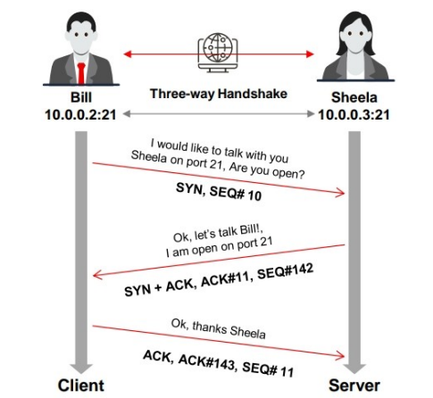
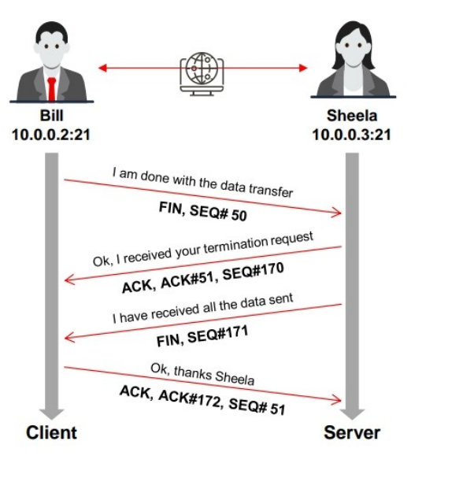
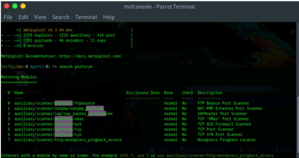
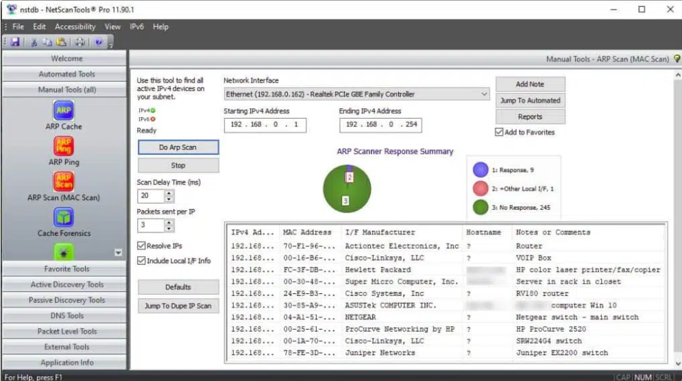
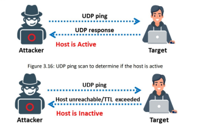
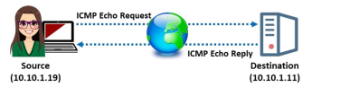
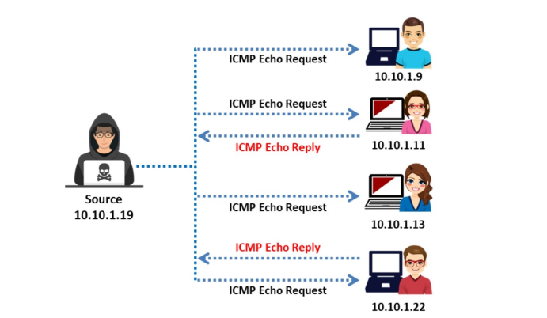
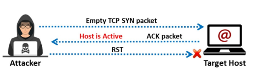
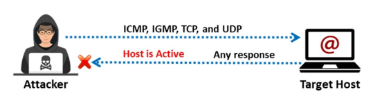

# Scanning Networks

# 1. What is Network Scanning?

Before scanning:
- Attacker first performs **Footprinting / Reconnaissance**
- Then starts **Scanning**

Scanning means:

> Collecting more detailed information about the target network or system.

The attacker tries to find:
- Live systems
- Open ports
- Running services
- Operating systems
- Vulnerabilities


# 2. Objectives of Network Scanning

Main goals:

| Objective | Purpose |
|---|---|
| Find live hosts | Identify active systems |
| Find open ports | Discover entry points |
| Identify services | Know what is running |
| Detect OS | Understand target environment |
| Find vulnerabilities | Discover weaknesses |
| Map network | Understand structure |

---

# 3. Types of Scanning

## A. Port Scanning

Checks:
- Which ports are open
- Which services are listening

### Example

| Port | Service |
|---|---|
| 80 | HTTP |
| 443 | HTTPS |
| 22 | SSH |

### Why Important?

Open ports can become entry points for attackers.

---

## B. Network Scanning

Finds:
- Active hosts
- IP addresses

### Goal

Know:
- Which systems are alive on the network

---

## C. Vulnerability Scanning


Searches for:
- Security weaknesses
- Misconfigurations
- Outdated software

### Example

- Old Apache server
- Weak SMB configuration
- Unpatched Windows system

---

# 4. Important Scanning Concepts

# TCP Communication Flags

TCP uses flags to control communication.

Important flags:

| Flag | Full Form | Purpose |
|---|---|---|
| SYN | Synchronize | Start connection |
| ACK | Acknowledgement | Confirm packet received |
| FIN | Finish | End connection |
| RST | Reset | Abort connection |
| PSH | Push | Send data immediately |
| URG | Urgent | Urgent processing |

---

# 5. TCP Three-Way Handshake

This is very important.

Connection establishment process:

```text
Client → SYN → Server
Client ← SYN-ACK ← Server
Client → ACK → Server
```

After this:
Connection established



# 6. TCP Connection Termination

Closing connection:

```text
Client → FIN → Server
Client ← ACK ← Server
Server → FIN → Client
Server ← ACK ← Client
```

Connection closed.



# 7. Scanning Tools

# A. Nmap

## What is Nmap?

Nmap = Network Mapper

Used for:
- Host discovery
- Port scanning
- Service detection
- OS detection

---

## Basic Syntax

```bash
nmap <target-ip>
```

Example:

```bash
nmap 192.168.1.1
```

# B. Hping3

## What is Hping3?

Hping3 is an advanced:
- Network scanning tool
- Packet crafting tool
- Firewall testing tool

It allows attackers or security testers to:
- Create custom TCP/IP packets
- Test firewall rules
- Scan ports
- Perform OS fingerprinting
- Analyze network behavior

---

# Features of Hping3

- ICMP Scanning
- TCP Scanning
- UDP Scanning
- SYN/ACK Scanning
- Firewall Testing
- Packet Crafting
- Traceroute Mode
- OS Fingerprinting
- Idle Host Scanning

---

# Basic Syntax

```bash
hping3 <options> <target-ip>
```

Example:

```bash
hping3 10.0.0.25
```

---

# Important Hping3 Commands

---

# 1. ICMP Ping Scan

## Command

```bash
hping3 -1 10.0.0.25
```

---

## Breakdown

| Part | Meaning |
|---|---|
| `hping3` | Tool name |
| `-1` | ICMP mode |
| `10.0.0.25` | Target IP |

---

## Purpose

Used to:
- Check whether host is alive
- Perform ping sweep
- Test connectivity

---

## How It Works

Hping3 sends:
- ICMP Echo Request packets

Target replies with:
- ICMP Echo Reply packets

Similar to:
```bash
ping 10.0.0.25
```

---

# 2. ACK Scan

## Command

```bash
hping3 -A 10.0.0.25 -p 80
```

---

## Breakdown

| Part | Meaning |
|---|---|
| `-A` | Set ACK flag |
| `-p 80` | Target port 80 |

---

## Purpose

Used for:
- Firewall detection
- Checking filtering rules

---

## How It Works

Hping3 sends:
- TCP packets with ACK flag set

### If:
- Firewall allows → Response received
- Firewall blocks → No response

---

## Important Note

ACK scan usually does:
- NOT determine open ports directly
- It mainly checks firewall behavior

---

# 3. UDP Scan

## Command

```bash
hping3 -2 10.0.0.25 -p 80
```

---

## Breakdown

| Part | Meaning |
|---|---|
| `-2` | UDP mode |
| `-p 80` | Target port |

---

## Purpose

Used to:
- Scan UDP ports
- Discover UDP services

---

## How It Works

Hping3 sends:
- UDP packets

### Responses:
| Response | Meaning |
|---|---|
| ICMP Port Unreachable | Port closed |
| No response | Port may be open |

---

# 4. SYN Scan

## Command

```bash
hping3 -8 50-60 -S 10.0.0.25
```

---

## Breakdown

| Part | Meaning |
|---|---|
| `-8` | Enable scan mode |
| `50-60` | Scan ports 50 to 60 |
| `-S` | Set SYN flag |
| `10.0.0.25` | Target IP |

---

## Purpose

Used to:
- Find open TCP ports
- Perform stealth scanning

---

## How It Works

Hping3 sends:
- SYN packets
- To ports 50 → 60

### Responses

| Response | Meaning |
|---|---|
| SYN-ACK | Port open |
| RST | Port closed |

---

## Similar Nmap Command

```bash
nmap -sS 10.0.0.25
```

---

# 5. FIN / PSH / URG Scan

## Command

```bash
hping3 -F -P -U 10.0.0.25 -p 80
```

---

## Breakdown

| Option | Meaning |
|---|---|
| `-F` | FIN flag |
| `-P` | PSH flag |
| `-U` | URG flag |
| `-p 80` | Target port |

---

## Purpose

Used for:
- Advanced stealth scanning
- Firewall evasion
- Detecting filtered ports

---

## How It Works

Hping3 sends:
- Special TCP packets with FIN, PSH, URG flags

### Responses

| Response | Meaning |
|---|---|
| No response | Port may be open |
| RST response | Port closed |

---

# 6. Collect Initial Sequence Numbers

## Command

```bash
hping3 192.168.1.103 -Q -p 139
```

---

## Purpose

Used to:
- Collect TCP sequence numbers
- Analyze TCP behavior

---

# 7. Firewall Timestamp Scan

## Command

```bash
hping3 -S 72.14.207.99 -p 80 --tcp-timestamp
```

---

## Purpose

Used to:
- Analyze firewall behavior
- Check TCP timestamp handling
- Estimate uptime

---

# 8. Scan Entire Subnet

## Command

```bash
hping3 -1 10.0.1.x --rand-dest -I eth0
```

---

## Purpose

Used to:
- Discover live hosts in subnet
- Perform random destination scanning

---

# 9. Intercept HTTP Traffic

## Command

```bash
hping3 -9 HTTP -I eth0
```

---

## Purpose

Used to:
- Capture packets containing HTTP signatures
- Monitor HTTP traffic

---

# 10. SYN Flood Attack

## Command

```bash
hping3 -S 192.168.1.1 -a 192.168.1.254 -p 22 --flood
```

---

## Purpose

Used to:
- Generate massive SYN packets
- Perform DoS attack simulation

---

# C. Metasploit

## What is Metasploit?

Penetration testing framework.

Used for:
- Exploitation
- Vulnerability scanning
- Payload generation
- Post exploitation

---

## Example Use

Search scanner modules:

```bash
search portscan
```

---


# D. NetScanTools Pro

GUI-based scanning tool.

Features:
- Port scanning
- DNS lookup
- Host discovery
- Network mapping

---


# Host Discovery Techniques

Host discovery techniques are used to identify:
- Active hosts
- Live systems
- Reachable devices

in a network.

---

# Types of Host Discovery Techniques

- ARP Ping Scan
- UDP Ping Scan
- ICMP Ping Scan
  - ICMP ECHO Ping
  - ICMP ECHO Ping Sweep
  - ICMP Timestamp Ping
  - ICMP Address Mask Ping
- TCP Ping Scan
  - TCP SYN Ping
  - TCP ACK Ping
- IP Protocol Ping Scan

---

# 1. ARP Ping Scan

## What is ARP Ping Scan?

ARP Ping Scan sends:
- ARP request packets

to discover:
- Active devices
- Live hosts
- MAC addresses

inside the local network.

---

## How It Works


If ARP response is received:  Host is active


---

## Important Note

Nmap uses ARP scan as the:
> Default ping scan in local networks

---

## Nmap Command

```bash
nmap -PR 10.10.1.11
```


---

## Meaning

| Option | Purpose |
|---|---|
| `-PR` | Perform ARP ping scan |

---

## Advantages

- Very accurate in LAN
- Faster host discovery
- Displays MAC addresses
- Useful for scanning large address spaces

---

# 2. UDP Ping Scan

## What is UDP Ping Scan?

UDP Ping Scan sends:
- UDP packets

to determine whether:
- Host is active
- Host is reachable

---

## How It Works

### Active Host && Inactive Host




---


---

## Nmap Command

```bash
nmap -PU 10.10.1.11
```

---

## Meaning

| Option | Purpose |
|---|---|
| `-PU` | UDP ping scan |

---

## Advantage

Useful for:
- Detecting systems behind firewalls
- Scanning networks where TCP is filtered

---

# 3. ICMP ECHO Ping Scan

## What is ICMP Ping Scan?

ICMP Ping Scan sends:
- ICMP Echo Request packets

to determine:
- Whether a host is alive

---

## How It Works




---

## Nmap Command

```bash
nmap -PE 10.10.1.11
```


---

## Meaning

| Option | Purpose |
|---|---|
| `-PE` | ICMP Echo ping scan |

---

## Result

If reply received: Host is up

---

# 4. ICMP ECHO Ping Sweep

## What is Ping Sweep?

Ping Sweep sends:
- ICMP Echo Requests
- To multiple hosts

to identify:
- All live systems in subnet

---

## How It Works




---

## Nmap Command

```bash
nmap -sn -PE 10.10.1.5-24
```


---

## Meaning

| Option | Purpose |
|---|---|
| `-sn` | Host discovery only |
| `-PE` | ICMP Echo scan |

---

## Purpose

Used for:
- Discovering multiple live hosts
- Network inventory

---

# 5. ICMP Timestamp Ping Scan

## What is ICMP Timestamp Ping?

Sends:
- ICMP Timestamp requests

to:
- Obtain time information
- Detect active hosts

---

## Purpose

Useful when:
- Traditional ICMP Echo is blocked

---

## Nmap Command

```bash
nmap -PP 10.10.1.11
```

---

## Meaning

| Option | Purpose |
|---|---|
| `-PP` | ICMP Timestamp ping |

---


---

# 6. ICMP Address Mask Ping Scan

## What is ICMP Address Mask Ping?

Sends:
- ICMP Address Mask requests

to:
- Obtain subnet mask information
- Detect active systems

---

```bash
nmap -PM 10.10.1.11
```

---

## Meaning

| Option | Purpose |
|---|---|
| `-PM` | ICMP Address Mask ping |

---

## Image


---

# 7. TCP SYN Ping Scan

## What is TCP SYN Ping?

TCP SYN Ping:
- Sends SYN packet
- Checks whether host responds

without establishing full connection.

---

## How It Works



---

## Nmap Command

```bash
nmap -PS 10.10.1.11
```

---

## Meaning

| Option | Purpose |
|---|---|
| `-PS` | TCP SYN ping |

---


## Advantages

- Faster scanning
- Bypasses some firewalls
- Stealthier than full TCP connection

---

# 8. TCP ACK Ping Scan

## What is TCP ACK Ping?

TCP ACK Ping:
- Sends ACK packets
- Detects active hosts

---

## How It Works

```text
Attacker → ACK Packet → Target
Attacker ← RST Packet ← Target
```

If RST received:
✅ Host is active

---

## Image


---

## Nmap Command

```bash
nmap -PA 10.10.1.11
```


## Meaning

| Option | Purpose |
|---|---|
| `-PA` | TCP ACK ping |

---

## Advantages

Useful for:
- Firewall bypassing
- Detecting filtered systems

---

# 9. IP Protocol Ping Scan

## What is IP Protocol Ping?

Sends:
- Different IP protocol packets

such as:
- ICMP
- IGMP
- TCP
- UDP

to determine:
- Whether host is online

---

## How It Works

```text
Attacker → ICMP/IGMP/TCP/UDP → Target
Attacker ← Any Response ← Target
```

If any reply received:
Host is active




---

## Nmap Command

```bash
nmap -PO 10.10.1.11
```

---

## Meaning

| Option | Purpose |
|---|---|
| `-PO` | IP Protocol ping |


---

# Quick Revision Table

| Scan Type | Purpose |
|---|---|
| ARP Ping | Discover local devices |
| UDP Ping | Detect hosts using UDP |
| ICMP Echo | Check live hosts |
| Ping Sweep | Find multiple live hosts |
| Timestamp Ping | Time-based host detection |
| Address Mask Ping | Detect subnet info |
| TCP SYN Ping | Stealth host discovery |
| TCP ACK Ping | Firewall bypass discovery |
| IP Protocol Ping | Detect online hosts |

---

# Important Exam Points

Focus on:
- Difference between ARP and ICMP scan
- TCP SYN vs TCP ACK ping
- Nmap options (`-PR`, `-PE`, `-PS`, `-PA`, `-PO`)
- Ping sweep concept
- Firewall bypass techniques
- Host discovery methods
