# Port and Service Discovery

# What is Port and Service Discovery?

After identifying live hosts, the next step is:
- Discovering open ports
- Identifying running services

Attackers use port scanning to:
- Find entry points
- Detect vulnerable services
- Gather information about target systems

Administrators use it to:
- Verify security policies
- Identify unnecessary open ports
- Improve network security

---

# Objectives of Port Scanning

- Discover open ports
- Identify running services
- Detect service versions
- Find vulnerable services
- Determine operating systems
- Map network structure

---

# Common Ports and Services

| Service Name | Port Number | Protocol | Description |
|---|---|---|---|
| FTP Data | 20 | TCP | FTP data transfer |
| FTP | 21 | TCP | File Transfer Protocol |
| SSH | 22 | TCP | Secure Shell remote login |
| Telnet | 23 | TCP | Remote terminal access |
| SMTP | 25 | TCP | Simple Mail Transfer Protocol |
| DNS | 53 | TCP/UDP | Domain Name System |
| DHCP Server | 67 | UDP | DHCP server service |
| DHCP Client | 68 | UDP | DHCP client service |
| TFTP | 69 | UDP | Trivial File Transfer Protocol |
| HTTP | 80 | TCP | HyperText Transfer Protocol |
| Kerberos | 88 | TCP/UDP | Authentication protocol |
| POP2 | 109 | TCP | Post Office Protocol v2 |
| POP3 | 110 | TCP | Post Office Protocol v3 |
| RPC | 111 | TCP/UDP | Remote Procedure Call |
| NetBIOS Name Service | 137 | TCP/UDP | NetBIOS naming |
| NetBIOS Datagram | 138 | UDP | NetBIOS datagram service |
| NetBIOS Session | 139 | TCP | NetBIOS session service |
| IMAP | 143 | TCP | Internet Message Access Protocol |
| SNMP | 161 | UDP | Simple Network Management Protocol |
| SNMP Trap | 162 | UDP | SNMP trap messages |
| LDAP | 389 | TCP/UDP | Lightweight Directory Access Protocol |
| HTTPS | 443 | TCP | Secure HTTP |
| Microsoft-DS | 445 | TCP | SMB over TCP |
| ISAKMP | 500 | UDP | VPN key exchange |
| Syslog | 514 | UDP | System logging |
| RIP | 520 | UDP | Routing Information Protocol |
| NFS | 2049 | TCP/UDP | Network File System |
| MySQL | 3306 | TCP | MySQL database |
| RDP | 3389 | TCP | Remote Desktop Protocol |
| PostgreSQL | 5432 | TCP | PostgreSQL database |
| VNC | 5900 | TCP | Virtual Network Computing |
| SIP | 5060 | TCP/UDP | VoIP signaling |
| X11 | 6000-6063 | TCP | X Window System |
| IRC | 6667 | TCP | Internet Relay Chat |
| HTTP Proxy | 8080 | TCP | Proxy server |
| HTTPS Alternate | 8443 | TCP | Secure alternate HTTPS |
| MSSQL Server | 1433 | TCP | Microsoft SQL Server |
| MSSQL Monitor | 1434 | UDP | Microsoft SQL Monitor |
| Oracle DB | 1521 | TCP | Oracle Database Listener |
| PPTP | 1723 | TCP | Point-to-Point Tunneling Protocol |
| SOCKS Proxy | 1080 | TCP | SOCKS proxy service |
| SMB | 445 | TCP | Server Message Block |
| NTP | 123 | UDP | Network Time Protocol |
| MongoDB | 27017 | TCP | MongoDB database |
| Redis | 6379 | TCP | Redis database |
| Docker | 2375 | TCP | Docker daemon |
| Kubernetes API | 6443 | TCP | Kubernetes API Server |
| Elasticsearch | 9200 | TCP | Elasticsearch service |
| Jenkins | 8080 | TCP | Jenkins web service |
| WinRM | 5985 | TCP | Windows Remote Management |
| WinRM HTTPS | 5986 | TCP | Secure WinRM |
| OpenVPN | 1194 | UDP | OpenVPN service |
| SMTPS | 465 | TCP | Secure SMTP |
| IMAPS | 993 | TCP | Secure IMAP |
| POP3S | 995 | TCP | Secure POP3 |

---

# Categories of Port Scanning Techniques

## TCP Scanning
- TCP Connect/Full-Open Scan
- Stealth/Half-Open Scan
- Inverse TCP Flag Scan
  - Xmas Scan
  - FIN Scan
  - NULL Scan
  - Maimon Scan
- ACK Flag Probe Scan
  - TTL-Based Scan
  - Window-Based Scan
- IDLE/IPID Header Scan

---

## UDP Scanning
- UDP Scan

---

## SCTP Scanning
- SCTP INIT Scan
- SCTP COOKIE/ECHO Scan

---

## SSDP Scanning
- SSDP and List Scanning

---

## IPv6 Scanning
- IPv6 Scanning

---

# 1. TCP Connect / Full-Open Scan

## What is TCP Connect Scan?

TCP Connect Scan:
- Completes full TCP three-way handshake
- Checks whether port is open

---

## Working Process

### Open Port && Closed Port

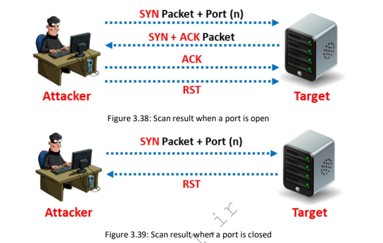

---

## Nmap Command

```bash
 nmap -sT -v 192.168.1.13
```
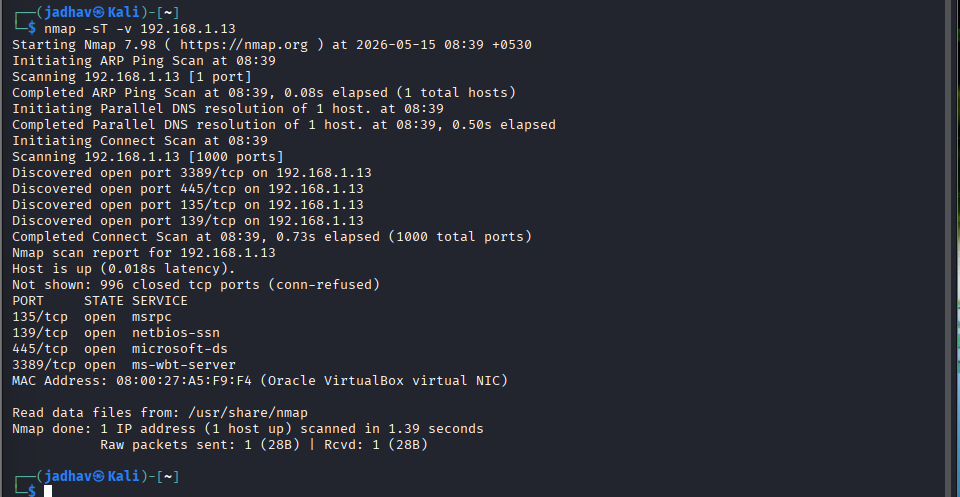
---

## Advantages

- Reliable
- Accurate

---

## Disadvantages

- Easily detected
- Generates logs
- Not stealthy

---

# 2. Stealth Scan (Half-Open Scan)

## What is Stealth Scan?

Stealth Scan:
- Sends SYN packet
- Does not complete full connection

Also called:
- SYN Scan
- Half-open Scan

---

## Working Process

### Open Port && Closed Port

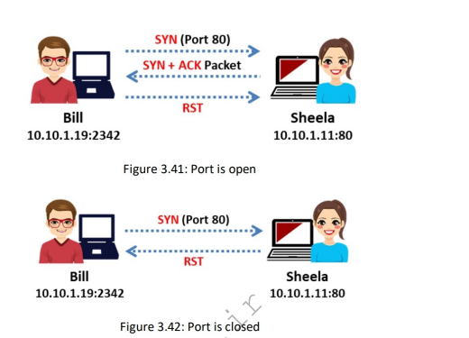

---

## Nmap Command

```bash
 nmap -sS -v 192.168.1.13
```
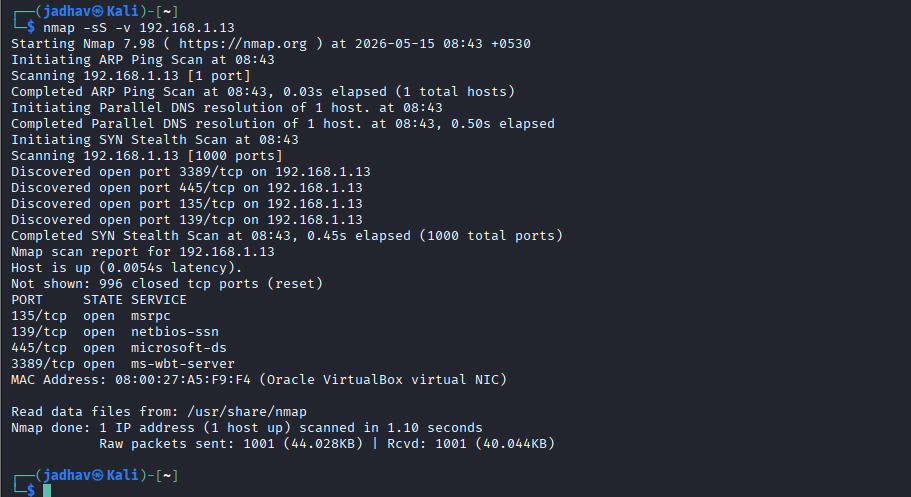
---

## Advantages

- Fast
- Stealthy
- Bypasses some logging systems

---

## Disadvantages

- May still be detected by IDS/IPS

---

# 3. Inverse TCP Flag Scan

## What is Inverse TCP Flag Scan?

Uses packets with:
- FIN
- URG
- PSH
- or no flags

---

## Responses

| Response | Meaning |
|---|---|
| No response | Port open |
| RST/ACK | Port closed |

---

## Types
- Xmas Scan


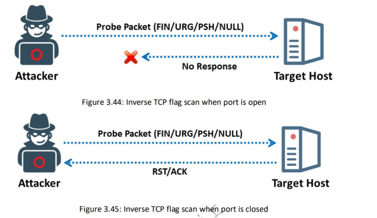

---

# 3.1. Xmas Scan

## What is Xmas Scan?

Sends packets with:
- FIN
- URG
- PSH flags enabled

---

## Working Process && Closed Port

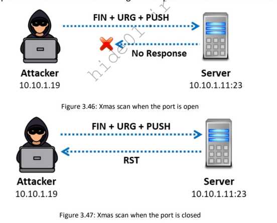

---

## Nmap Command

```bash
 nmap -sX -v 192.168.1.13
```
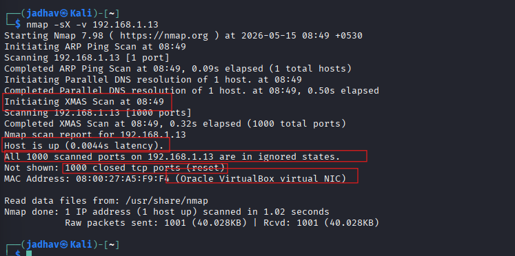

- The Xmas scan (-sX) was performed on the target IP address 192.168.1.13. 
- The host was found to be active, but all 1000 scanned TCP ports responded with RST packets, indicating that all ports are closed. 
- No open ports or services were detected on the target system.
---

## Advantages

- Avoids some IDS systems
- No full TCP handshake

---

## Disadvantages

- UNIX-only effectiveness
- Fails on many Windows systems

---


# 4. TCP Maimon Scan

## What is Maimon Scan?

Similar to:
- FIN Scan
- NULL Scan
- Xmas Scan

Uses:
- FIN/ACK packets

---

## Responses

| Response | Meaning |
|---|---|
| No response | Open/Filtered |
| RST | Closed |
| ICMP unreachable | Filtered |

---

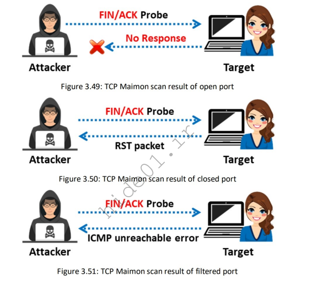

---

## Nmap Command

```bash
 nmap -sM -v 192.168.1.13                                                                                       
```
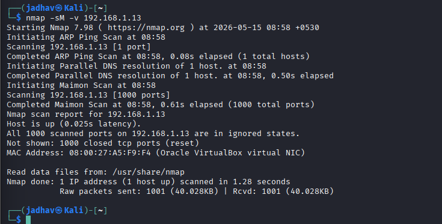

- The Maimon scan (-sM) was performed on the target IP address 192.168.1.13. 
- The host was active and reachable on the network. 
- All 1000 scanned TCP ports returned RST responses, indicating that all ports are closed. 
- No open ports or running services were identified on the target system.
---

# 5. ACK Flag Probe Scan

## What is ACK Scan?

Sends:
- ACK packets

Used for:
- Firewall detection
- Filtering analysis

---

## Working Process

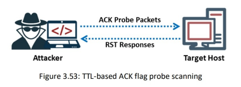

---

## Nmap Command

```bash
 nmap -sA -v 192.168.1.13
```
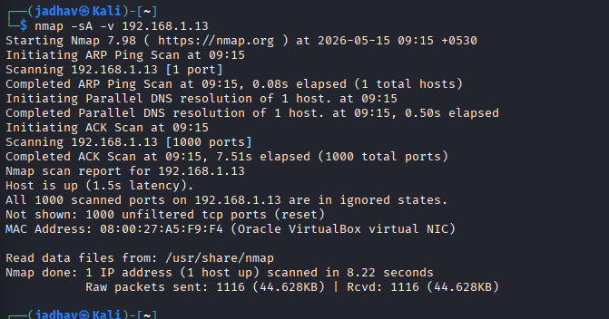
---

# 6. TTL-Based ACK Scan

## What is TTL Scan?

Analyzes:
- TTL value of RST packets

---

## Rule

| TTL Value | Meaning |
|---|---|
| TTL < 64 | Port open |
| TTL > 64 | Port closed |

---


---


# 7. Window-Based ACK Scan

## What is Window Scan?

Analyzes:
- TCP window size

---

## Rule

| Window Value | Meaning |
|---|---|
| Non-zero | Port open |
| Zero | Port closed |

---

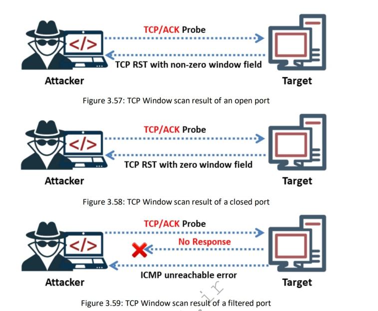

---

# 8. Firewall Detection using ACK Scan

## Stateful Firewall Present

```text
Attacker → ACK Probe → Target
No Response
```

 Firewall Present

---

## No Firewall

```text
Attacker → ACK Probe → Target
RST Response
```

❌ No Firewall

---


---

# 9. IDLE/IPID Header Scan

## What is IDLE Scan?

Advanced stealth scanning technique using:
- Spoofed IP address
- Zombie system

---

# Important Terms

| Term | Meaning |
|---|---|
| Zombie | Idle host used for scanning |
| IPID | IP Identification value |

---

# IDLE Scan Steps

## Step 1 — Probe Zombie

```text
Attacker → SYN/ACK → Zombie
Zombie → RST(IPID=X) → Attacker
```

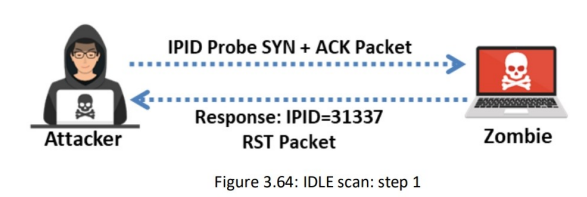

---

## Step 2 — Spoof SYN Packet

```text
Attacker → SYN(spoofed zombie IP) → Target
```

### If Port Open

```text
Target → SYN/ACK → Zombie
Zombie → RST → Target
```

Zombie IPID increases.

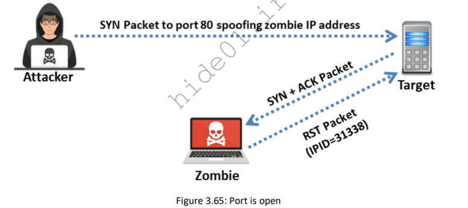

---

## Step 3 — Probe Zombie Again

```text
Attacker → SYN/ACK → Zombie
Zombie → RST(IPID=X+2) → Attacker
```

If IPID increased:

✅ Port is Open

---

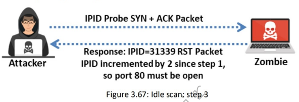

---

## Nmap Command

```bash
nmap -sI zombie_ip target_ip
```

Example:

```bash
nmap -sI 10.10.1.19 10.10.1.11
```

---

## Advantages

- Extremely stealthy
- Hides attacker identity

---

## Disadvantages

- Complex setup
- Requires idle zombie system

---

# 13. UDP Scan

## What is UDP Scan?

UDP scanning:
- Uses UDP instead of TCP
- No three-way handshake

---

## Working Process

### Open Port

```text
Attacker → UDP Packet → Target
No Response
```

Port may be Open

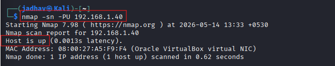

---

### Closed Port

```text
Attacker → UDP Packet → Target
ICMP Port Unreachable ← Target
```

Port Closed

---

## Nmap Command

```bash
nmap -sU 10.10.1.22
```

---

## Advantages

- Useful for discovering UDP services
- Can bypass some TCP filters

---

## Disadvantages

- Slow scanning
- Difficult to identify open ports

---

# 14. SCTP INIT Scan

## What is SCTP?

SCTP:
- Stream Control Transmission Protocol

Uses:
- Four-way handshake

---

## SCTP Four-Way Handshake

```text
Client → INIT → Server
Client ← INIT-ACK ← Server
Client → COOKIE-ECHO → Server
Client ← COOKIE-ACK ← Server
```

---

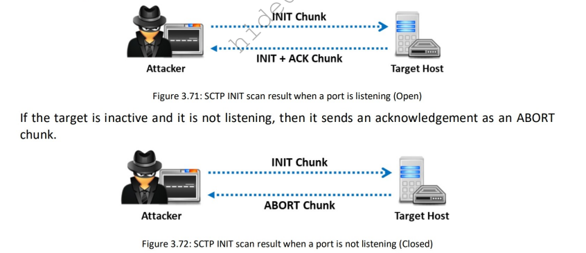

---

## Working Process

### Open Port

```text
Attacker → INIT Chunk → Target
Attacker ← INIT-ACK ← Target
```

✅ Port Open

---

### Closed Port

```text
Attacker → INIT Chunk → Target
Attacker ← ABORT Chunk ← Target
```

❌ Port Closed

---

## Nmap Command

```bash
nmap -sY 10.10.1.11
```

---

## Advantages

- Distinguishes open/closed/filtered ports
- More stealthy than full SCTP connection

---

# 15. SCTP COOKIE-ECHO Scan

## What is SCTP COOKIE-ECHO Scan?

Uses:
- COOKIE-ECHO chunk

More stealthy than:
- SCTP INIT scan

---

## Working Process

### Open Port && Closed Port

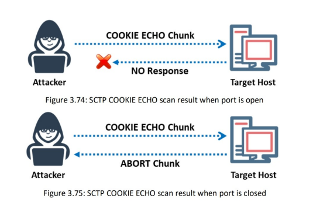

---

## Nmap Command

```bash
nmap -sZ 10.10.1.11
```

---

## Advantages

- Stealthy
- Harder to detect

---

## Disadvantages

- Cannot clearly distinguish open and filtered ports

---

# 16. SSDP Scan

## What is SSDP?

SSDP:
- Simple Service Discovery Protocol

Used in:
- UPnP devices

---

## Purpose

Used for:
- Discovering network devices
- Finding UPnP-enabled systems
- Detecting vulnerable IoT devices

---

## Metasploit Command

```bash
use auxiliary/scanner/upnp/ssdp_msearch
```

---

# 17. List Scan

## What is List Scan?

List Scan:
- Displays target information
- Does not actively scan hosts

---

## Nmap Command

```bash
nmap -sL 10.10.1.11
```

---

## Advantages

- Fast
- Useful for validating targets

---

# 18. IPv6 Scan

## What is IPv6 Scanning?

Scans:
- IPv6 hosts and services

IPv6 uses:
- 128-bit addressing

---

## Challenges

- Huge address space
- Difficult host discovery
- Traditional ping sweeps less effective

---

## Nmap Command

```bash
nmap -6 scanme.nmap.org
```

---
